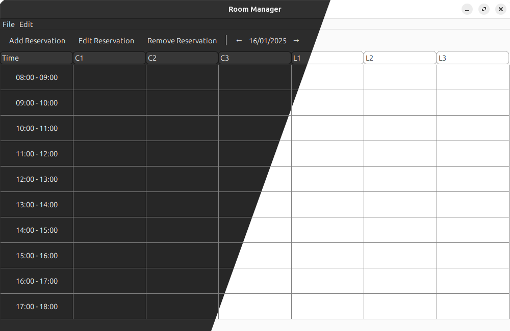
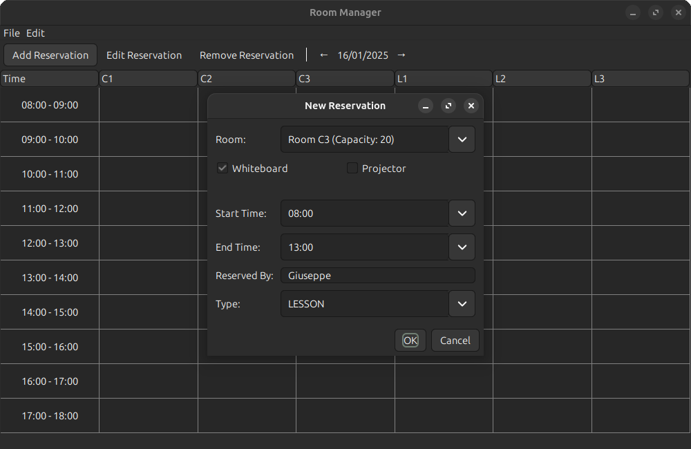
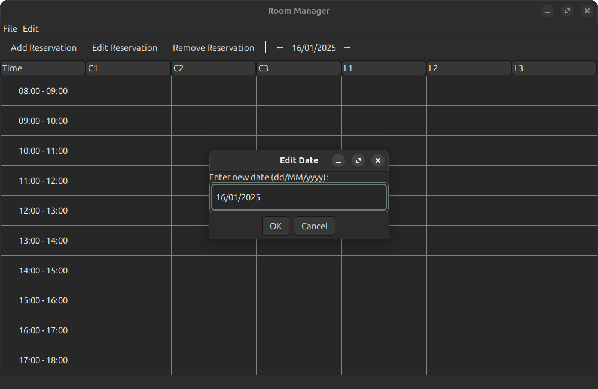

# **RoomManager**

A Java-based application designed to manage room reservations for classrooms and laboratories.

### **Features**

- **Room Management**: Add and manage different types of rooms (Classrooms and Laboratories) with specific features.
- **Reservation Management**: Create, edit, and delete reservations for rooms with validation to prevent conflicts.
- **Auto-Save**: Automatically saves reservations at regular intervals.
- **File Operations**: Save and load reservations from files.
- **User Interface**: Intuitive GUI built with Swing and AWT.
- **Date Navigation**: Navigate between dates using arrow buttons or double-click the date label to enter a new date.
- **Printing**: Print the reservation table.
- **Room Configuration**: Rooms are loaded from a file located at `config/rooms.txt`, which can be modified as needed.
- **Portable JAR**: When the JAR file is created, the `config/rooms.txt` file is included, allowing the application to work anywhere on its own.
- **System Theme Integration**: Adapts to the current system theme (light/dark).
- **End Time Calculation**: Automatically calculates selectable end times based on room type and start time:
  - Classrooms: 1 to 8 hours
  - Laboratories: 2 or 4 hours

### **Prerequisites**

- **Java Development Kit** (JDK) 8 or higher
- **Make** (optional, for using the provided Makefile)

### **Installation**

1. **Clone the repository:**
   ```sh
   git clone https://github.com/giuseppepelusi/RoomManager.git
   ```

   or

   ```sh
   git clone git@github.com:giuseppepelusi/RoomManager.git
   ```

2. **Move to the repository directory:**
    ```sh
    cd RoomManager
    ```

3. Compile and run the project:
   ```sh
   make
   ```

### **Using the Makefile**

The provided Makefile includes several targets for common tasks:

- **Compile the project**:
  ```sh
  make compile
  ```

- **Run the application**:
  ```sh
  make run
  ```

- **Create a JAR file**:
  ```sh
  make jar
  ```

- **Generate documentation**:
  ```sh
  make doc
  ```

- **Clean the build and documentation directories**:
  ```sh
  make clean
  ```

### **File Structure**

- **src/app**: Contains the main entry point for the application.
- **src/controllers**: Contains the controllers for managing reservations, file operations, and auto-saving.
- **src/models**: Contains the data models for reservations and rooms.
- **src/utils**: Contains utility classes for date/time operations, UI operations, and validation.
- **src/views**: Contains the Swing-based user interface components.
- **config/rooms.txt**: Contains the room configurations that can be modified as needed.

### **Screenshots**

**Main Window**



**Add Reservation Dialog**



**Edit Date Dialog**

